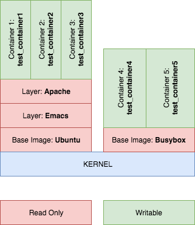
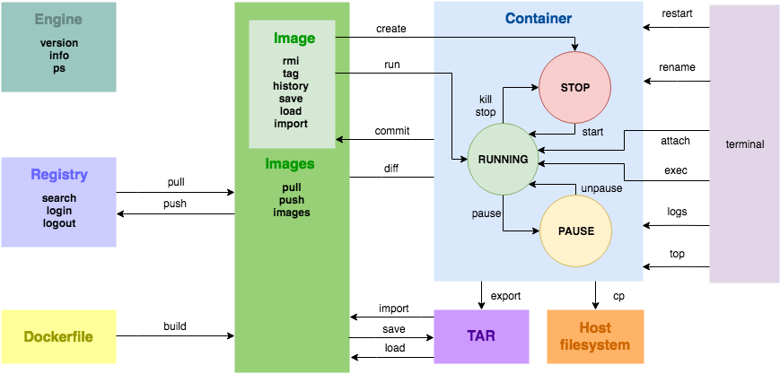

Docker Cheat Sheet
==================
Aggregation of my personal notes collected during daily work with the Docker

<p align="center">

</p>

## Glossary
Based on official [Docker glossary](https://docs.docker.com/glossary/)

* `container` is a runtime instance of a docker image. Containers are isolated processes, not virtual machines.
A Docker container consists of a Docker image, an execution environment and, a standard set of instructions.
* `cgroups ` is a Linux kernel feature that limits, accounts for, and isolates the resource usage (CPU, memory, disk I/O, network, etc.) of a collection of processes. Docker relies on cgroups to control and isolate resource limits.
* `Docker` project as a whole, which is a platform for developers and sysadmins to develop, ship, and run apps. Docker is an open-source utility that automates the deployment and management of programs inside software containers.
The docker daemon process running on the host which manages images and containers (also called Docker Engine).
* `Docker Compose` is a tool for defining and running complex applications with Docker.
* `Docker Hub` is a centralized resource for working with Docker and its components. 
* `Dockerfile` is a text document that contains all the commands you would normally execute manually in order to build a Docker image. Docker can build images automatically by reading the instructions from a Dockerfile.
* `Docker Swarm` is the name of a standalone native clustering tool for Docker. Docker Swarm pools together several Docker hosts and exposes them as a single virtual Docker host. It serves the standard Docker API, so any tool that already works with Docker can now transparently scale up to multiple hosts.
* `image` Docker images are the basis of containers. An Image is an ordered collection of root filesystem changes and the corresponding execution parameters for use within a container runtime. An image typically contains a union of layered filesystems stacked on top of each other. An image does not have state and it never changes.
* `layer` In an image, a layer is modification to the image, represented by an instruction in the Dockerfile. Layers are applied in sequence to the base image to create the final image. When an image is updated or rebuilt, only layers that change need to be updated, and unchanged layers are cached locally. This is part of why Docker images are so fast and lightweight. The sizes of each layer add up to equal the size of the final image.
* `namespace` A Linux namespace is a Linux kernel feature that isolates and virtualizes system resources. Processes which restricted to a namespace can only interact with resources or processes that are part of the same namespace. Namespaces are an important part of Docker’s isolation model. Namespaces exist for each type of resource, including net (networking), mnt (storage), pid (processes), uts (hostname control), and user (UID mapping). For more information about namespaces, see Docker run reference and Introduction to user namespaces.
* `node` is a physical or virtual machine running an instance of the Docker Engine in swarm mode.
* `registry` is a hosted service containing repositories of images which responds to the Registry API. The default registry can be accessed using a browser at Docker Hub or using the `docker search` command.
* `repository` is a set of Docker images. A repository can be shared by pushing it to a registry server. The different images in the repository can be labeled using tags.
* `swarm` is a cluster of one or more Docker Engines running in swarm mode.
* `Swarm mode` refers to cluster management and orchestration features embedded in Docker Engine. When you initialize a new swarm (cluster) or join nodes to a swarm, the Docker Engine runs in swarm mode.
* `tag` is a label applied to a Docker image in a repository. Tags are how various images in a repository are distinguished from each other.
* `Union file system (UnionFS)` - Union file systems implement a union mount and operate by creating layers. Docker uses union file systems in conjunction with copy-on-write techniques to provide the building blocks for containers, making them very lightweight and fast.

## Docker container vs Docker image

<p align="center">

</p>

* `Docker image`
	* base of container 
	* layered filesystems (stack) 
	* read only 
	* never changes
* `Docker container ` 
	* runtime instance of a `Docker image`
	* contains a reference to `Docker image`
	* containers are isolated processes

## Docker commands:

<p align="center">

</p>

### Docker engine commands
 * `docker version` - show the Docker version information (version of client/server, API, Go, OS/Arch type, etc)
 * `docker info` - display system-wide information (containers status, images count, CPUs OS type, etc)
 * `docker events` - get real time events from the server

### Docker registry commands
 * `docker search` - search the Docker Hub for images 
 * `docker login` - log in to a Docker registry
 * `docker logout ` - log out from a Docker registry

 ```
 Example of docker search:
 
 # search ubuntu image
 docker search ubuntu
 ```

### Dockerfile commands
* `docker build` - build an image from a [Dockerfile](https://docs.docker.com/engine/reference/builder/#shell-form-entrypoint-example)

 ```
 Example of docker build:
 
 # build an image form a Dockerfile located in the current folder 
 # and set a tag `myimage:latest` for new image
 docker build -t "myimage:latest" .
 ```

### Docker images commands
* `docker pull` - pull an image or a repository from a registry
* `docker push` - push an image or a repository to a registry
* `docker images` - list images

 ```
 Example of docker pull, save, load:
 
 # pull `busybox` image from registry
 docker pull busybox
 ```

### Docker image commands
* `docker history` - show the history of an image
* `docker tag` - create a tag `TARGET_IMAGE` that refers to `SOURCE_IMAGE`
* `docker rmi` - remove one or more images
* `docker image rm $(docker image ls -a -q)` - remove all images
* `docker save` - save one or more images to a tar archive
* `docker load` - load an image from a tar archive or STDIN
* `docker import` - import the contents from a tarball to create a filesystem image

 ```
 Example docker tag, rmi:
 
 # create a tag `mytag` that refers to `busybox` image
 docker tag busybox busybox:mytag
 
 # remove `busybox` image
 docker rmi busybox
 ```
 ```
 Example of docker save, load:
 
 # pull `busybox` image from registry
 docker pull busybox

 # save `busybox` image
 docker save busybox > busybox.tar
 
 # remove `busybox` image
 docker rmi busybox
 
 # load `busybox` image from TAR file
 docker load < busybox.tar
 ```
 
### Docker ps command
* `docker ps` - show only running containers
* `docker ps -a` - show all containers (all statuses)
* `docker ps -f`- filter output based on conditions provided
* `docker ps -n`- show n last created containers (includes all states) (default -1)
* `docker ps -l` - show the latest created container (includes all states)
* `docker ps -q` - only display numeric IDs
* Show n last created containers (includes all states) (default -1)
* `docker ps -s` - display total file sizes

 ```
 Example of docker ps:
 
 # docker --format placeholders
 # .ID - Container ID
 # .Image - Image ID
 # .Command - Quoted command
 # .CreatedAt - Time when the container was created.
 # .RunningFor - Elapsed time since the container was started.
 # .Ports - Exposed ports.
 # .Status - Container status.
 # .Size - Container disk size.
 # .Names - Container names.
 # .Labels - All labels assigned to the container.
 # .Label - Value of a specific label for this container: 
 # .Mounts - Names of the volumes mounted in this container.
 
 # show only running formatted as ID / Image / Ports / Names
 docker ps --format "{{.ID}} / {{.Image}} / {{.Ports}} / {{.Names}}"
 
 # show all containers formatted as ID / Image / Ports / Names
 docker ps -a --format "{{.ID}} / {{.Image}} / {{.Ports}} / {{.Names}}"
 
 # show all containers formatted as table ID, IMAGE, PORTS, NAMES
 docker ps -a --format "table {{.ID}}\t{{.Image}}\t{{.Ports}}\t{{.Names}}"
 
 # show all containers based on `nginx`
 docker ps -a -f=ancestor=nginx
 ```
 
### Docker container commands
* `docker create` - create a new container
* `docker run` - run a command in a new container
* `docker start` - start one or more stopped containers
* `docker stop` - stop one or more running containers
* `docker restart` - restart one or more containers
* `docker attach` - attach local standard input, output, and error streams to a running container
* `docker kill` - kill one or more running containers
* `docker pause` - pause all processes within one or more
* `docker unpause` - unpause all processes within one or more containers
* `docker rename` - rename a container
* `docker rm` - remove one or more containers
* `docker exec` - run a command in a running container
* `docker diff` - inspect changes to files or directories on a container's filesystem
* `docker cp` - copy files/folders between a container and the local filesystem
* `docker commit` - create a new image from a container's changes
* `docker export` - export a container's filesystem as a tar archive
* `docker logs -f` - fetch the logs of a container
* `docker top` - display the running processes of a container
* `docker port` - list port mappings or a specific mapping for the container

 ```
 Example of docker create, ps, rm, start, stop, attach:
 
 # create a new container based on the Ubuntu image, with:
 # - random name i.e `festive_gates`
 # - random ID i.e `37a0cb4dd740`
 # - status `Created`
 # - enabled `-it` (STDIN + pseudo-TTY for input commands)
 docker create -it ubuntu /bin/bash
 
 # show all containers (all statuses)
 docker ps -a
 
 # show the latest created container 
 docker ps -l
 
 # show the latest created container with formatted result: ID, Status, Names
 docker ps -l --format "{{.ID}} {{.Status }} {{.Names}}"
 
 # result of above command formatted as: ID, Status, Names
 37a0cb4dd740 Created festive_gates
 
 # remove created container by ID
 docker rm 37a0cb4dd740
 
 # create a new container as above but with a name: `test_create_ubuntu`
 docker create -it --name test_create_ubuntu ubuntu /bin/bash
 
 # start container
 docker start test_create_ubuntu
 
 # attach keyboard input to container
 docker attach test_create_ubuntu
 
 # logged into container
 root@c5d448c6117c:/#
 
 # exit from container
 root@c5d448c6117c:/# exit
 
 # stop container
 docker stop test_create_ubuntu
 
 # remove container
 docker rm test_create_ubuntu
 ```
 ```
 Example of docker run, ps, rm, start, stop, attach:
 
 # run a command in new container based on the Ubuntu image, with:
 # - random name i.e `stupefied_montalcini`
 # - random ID i.e `30f2887203f3`
 # - status `Up`
 # - enabled `-it` (STDIN + pseudo-TTY for input commands)
 docker run -it ubuntu /bin/bash
 
 # result of about command, logged into container
 root@30f2887203f3:/#
 
 # exit from container
 root@30f2887203f3:/# exit
 
 # show all containers (all statuses)
 docker ps -a
 
 # show the latest created container 
 docker ps -l
 
 # show the latest created container with formatted result: ID, Status, Names
 docker ps -l --format "{{.ID}} {{.Status }} {{.Names}}"
 
 # result of above command formatted as: ID, Status, Names
 30f2887203f3 Exited (0) 3 seconds ago stupefied_montalcini
 
 # create a new container as above but with a name: `test_run_ubuntu`
 docker run -it --name test_run_ubuntu ubuntu /bin/bash
 
 # logged into container
 root@83d51a5964d7:/#

 # exit from container
 root@ 83d51a5964d7:/# exit

 # stop container
 docker stop test_run_ubuntu

 # remove container
 docker rm test_run_ubuntu
 ```
 ```
 Example of docker run with a command:
 
 # run a ping command from a container and
 # remove container on exit by --rm parameter
 docker run --rm busybox ping google.com
 
 # example result
 64 bytes from 216.58.201.110: seq=0 ttl=37 time=41.393 ms
 64 bytes from 216.58.201.110: seq=1 ttl=37 time=44.513 ms
 64 bytes from 216.58.201.110: seq=2 ttl=37 time=43.191 ms
 
 # run date command from a container and
 # remove container on exit by --rm parameter
 docker run --rm ubuntu date
 
 # example result
 Mon Mar 26 18:35:16 UTC 2018
 ```
 ```
 Example of docker run with port mapping:
 
 # run a new container based on the Nginx image, with:
 # - enabled `-d` that runs a container in a background
 # - enabled `-p 80` that publish port 80 of the container 
 # to all interfaces of the host with a dynamically allocated port.
 # The Nginx by default exposes port 80
 docker run -d --name test_nginx_1 -p 80 nginx
 
 # check port mapping
 docker port test_nginx_1
 
 # example result of above command
 80/tcp -> 0.0.0.0:32773
 
 # test `test_nginx_1` server
 curl http://localhost:32773
 
 # - enabled `-p 8080:80` that publish port 80 of the container
 # to all interfaces of the host with a static port 8080
 docker run -d --name test_nginx_2 -p 8080:80 nginx
 
 # test `test_nginx_2` server
 curl http://localhost:8080
 ```
 ```
 Example of docker kill:
 
 # create a new container with a name `test_kill`
 docker create -it --name test_kill ubuntu /bin/bash
 
 # start container
 docker start test_kill
 
 # kill container
 docker kill test_kill
 ```
 ```
 Example of docker rename:
 
 # create a new container with a name `test_rename`
 docker run --name test_rename ubuntu /bin/bash
 
 # rename `test_rename` container to `renamed_test`
 docker rename test_rename renamed_test
 
 # show the latest created container, should contains `renamed_test`
 docker ps -l
 ```
 ```
 Example of docker pause, unpause, logs:
 
 # run a new container with a script that prints a date in 1 second interval, with:
 # - enabled `-d` that runs a container in a background
 docker run -d --name test_pause ubuntu /bin/sh -c "while true; do date; sleep 1; done"
 
 # fetch the logs of a container
 docker logs -f test_pause
 
 # example result of above command, new log per 1 second
 Sun Mar 25 17:48:46 UTC 2018
 Sun Mar 25 17:48:47 UTC 2018
 Sun Mar 25 17:48:48 UTC 2018
 ...
 
 # pause container
 docker pause test_pause
 
 # fetch the logs of container
 docker logs -f test_pause
 
 # example result of above command, no new logs
 Sun Mar 25 17:52:26 UTC 2018
 Sun Mar 25 17:52:27 UTC 2018
 Sun Mar 25 17:52:28 UTC 2018
 
 # unpause container
 docker unpause test_pause
 
 # fetch the logs of container
 docker logs -f test_pause
 
 # example result of above command, new log per 1 second
 Sun Mar 25 17:54:38 UTC 2018
 Sun Mar 25 17:54:39 UTC 2018
 Sun Mar 25 17:54:40 UTC 2018
 ...
 
 # stop container
 docker stop test_pause
 ```
 ```
 Example of docker exec:
 
 # run a new container with a name `nginx_server`
 docker run -d --name nginx_server -p 8080:80 nginx
 
 # run /bin/bash command in `nginx_server` container (terminal)
 docker exec -it nginx_server /bin/bash
 
 # example result
 root@479d0e43f6c4:/#
 
 # exit from container
 root@479d0e43f6c4:/# exit
 
 # run date `nginx_server` container
 docker exec nginx_server date
 
 # example result
 Mon Mar 26 19:20:28 UTC 2018
 ```
 ```
 Example of docker cp, diff:
 
 # run a new container with a name `test_cp_ubuntu`
 docker run -it --name test_cp_ubuntu ubuntu /bin/bash
 
 # create a new file container_file.txt in container
 root@968c86596a3b:/# echo "Container file" > container_file.txt
 
 # exit from container
 root@968c86596a3b:/# exit
 
 # copy a file container_file.txt from `test_cp_ubuntu` container to host
 docker cp test_cp_ubuntu:/container_file.txt container_file.txt
 
 # test container_file.txt
 cat container_file.txt
 
 # result
 Container file
 
 # create a new file host_file.txt on host 
 echo "Host file" > host_file.txt
 
 # copy a file host_file.txt from host to `test_cp_ubuntu` container
 docker cp host_file.txt test_cp_ubuntu:/host_file.txt
 
 # start container
 docker start test_cp_ubuntu
 
 # attach keyboard input to container
 docker attach test_cp_ubuntu
 
 # test host file
 root@968c86596a3b:/# cat host_file.txt

 # result
 Host file
 
 # inspect changes to files or directories on a container's filesystem
 docker diff test_cp_ubuntu
 
 # example result
 A /container_file.txt
 A /host_file.txt
 C /root
 A /root/.bash_history
 ```
 ```
 Example of docker commit:
 
 # create a new container with a name `test_commit`
 docker run -it --name test_commit ubuntu /bin/bash
 
 # store a date to file.txt
 root@bf6d4aeae802:/# date > file.txt
 
 # test file
 root@bf6d4aeae802:/# cat file.txt
 
 # example result
 Mon Mar 26 20:11:16 UTC 2018
 
 # exit from container
 root@bf6d4aeae802:/# exit
 
 # create a new image `new_test_commit_image` 
 # from a `test_commit` container's changes
 docker commit test_commit new_test_commit_image
 
 # image should be on list
 docker images
 
 # create a new container with a name `test_commit_new` 
 # based on `new_test_commit_image`
 docker run -it --name test_commit_new new_test_commit_image /bin/bash
 
 # test file.txt stored before commit
 root@9f283ac64e1d:/# cat file.txt

 # result
 Mon Mar 26 20:21:29 UTC 2018
 ```
 ```
 Example of docker export, import:
 
 # create a new container with a name `test_export` 
 # based on Busybox image
 docker create --name test_export busybox
  
 # export `test_export` container to TAR file
 docker export test_export > test_export.tar
 
 # remove `test_export` container
 docker rm test_export
 
 # import `test_export` as `busybox-export` image
 cat test_export.tar | docker import - busybox-export
 
 # list images, image `busybox-export` should be on list
 docker images
 
 # run a new container `test_export` based on `busybox-export` image
 docker run -it --name test_export busybox-export /bin/sh
 ```
 ```
 Example of docker top:
 
 # run a new container with a name `test_top`
 docker run -d --name test_top -p 8080:80 nginx
 
 # display the running processes of a `test_top` container
 docker top test_top
 
 # example result
 PID		USER		TIME		COMMAND
 5815		root		0:00		nginx: master process nginx -g daemon off;
 5851		101			0:00		nginx: worker process
 ```
 
### Docker inspect command
 * `docker inspect` - return low-level information on Docker objects

 ```
 Example of docker inspect:
 
 # create a new container with name `test_inspect`
 docker run -v /test_directory --name test_inspect ubuntu
 
 # basic usage of docker inspect
 docker inspect test_inspect
 
 # example result of above command (sample of JSON)
 [{
 	"Id": "13074e2597ee1beedad7218b36df2da13851dfbb8f2712d4b2408003d300cf1b",
   "Created": "2018-04-01T22:14:24.725012738Z",
   "Path": "/bin/bash",
   ...
 }]
 
 # extract name of container
 docker inspect -f '{{.Name}}' test_inspect
 
 # result of above command
 /test_inspect
 
 # check IP of container
 docker inspect -f '{{.NetworkSettings.IPAddress}}' test_inspect
 
 # result of above command
 172.17.0.3
 
 # filter mounted volumes of container
 docker inspect -f '{{ .Mounts }}' test_inspect
 
 # example result of above command
 [{volume 1c7951286a1975d8399fb7b0e393999628276a43c9a160e6318b4b7435578738 
 /var/lib/docker/volumes/1c7951286a1975d8399fb7b0e393999628276a43c9a160e6318b4b7435578738/_data 
 /test_directory local  true }]
 
 # check if latest container still running
 docker inspect --format '{{.State.Running}}' $(docker ps -lq)
 
 # result of above command
 false
 ```
 
### Docker volume managment
* `docker volume create` - create a volume
* `docker volume inspect` - display detailed information on one or more volumes
* `docker volume ls` - list volumes
* `docker volume prune` - remove all unused local volumes
* `docker volume rm` - remove one or more volumes

 ```
 Example of docker volume inspect, ls, rm:
 
 # create a new container with a name `test_volume1` with
 # - v /test_directory (test_directory created in container) 
 docker run -it -v /test_directory --name test_volume1 ubuntu
 
 # logged into container and list directory contents
 root@29157acd5730:/# ls
 
 # example result of above command
 test_directory - should exists on list
 
 # exit from container
 root@29157acd5730:/# exit
 
 # return low-level information on Docker objects
 # filtered by mounted volumes
 docker inspect -f '{{ .Mounts }}' test_volume1
 
 # example result of above command, ID of volume
 volume 619f2450dcae05a595328732403ad4bfd489395ac5e21a1339d1f084325b45d0
 
 # display detailed information on volume of above ID
 docker volume inspect 619f2450dcae05a595328732403ad4bfd489395ac5e21a1339d1f084325b45d0
 
 # example result of above command
 [{
	"CreatedAt": "2018-03-31T21:07:46Z",
	"Driver": "local",
	"Labels": null,
	"Mountpoint": 
	"/var/lib/docker/volumes/619...5d0/_data",
	"Name": "619...5d0",
	"Options": {},
	"Scope": "local"
 }]
 
 # list volumes
 docker volume ls
 
 # example result of above command, example volume ID should be on list
 DRIVER 	VOLUME
 local  	619f2450dcae05a595328732403ad4bfd489395ac5e21a1339d1f084325b45d0
 
 # remove `test_volume1` container
 docker rm test_volume1
 
 # remove volume of `test_volume1` container
 docker volume rm 619f2450dcae05a595328732403ad4bfd489395ac5e21a1339d1f084325b45d0
 
 # list volumes, in result, above volume ID should not be on list
 docker volume ls
 ```
 ```
 Example of docker volume prune:
 
 # create a new container with a name `test_volume2` with
 # -v /test_directory (test_directory created in container) 
 docker run -it -v /test_directory --name test_volume2 ubuntu
 
 # logged into container, and exit
 root@7f5ee1d3b3f5:/# exit
  
 # return low-level information on Docker objects
 # filtered by mounted volumes
 docker inspect -f '{{ .Mounts }}' test_volume2
 
 # example result of above command, ID of volume
 volume 804bb1b8b588d56b624c8f61c848496f04986b4b6551830f7851879b5f4cb549
  
 # list volumes
 docker volume ls
 
 # example result of above command, example volume ID should be on list
 DRIVER 	VOLUME NAME
 local  	804bb1b8b588d56b624c8f61c848496f04986b4b6551830f7851879b5f4cb549
 
 # remove `test_volume2` container
 docker rm test_volume2
 
 # remove all unused local volumes
 docker volume prune
 
 # list volumes, in result, above volume ID should not be on list
 docker volume ls
 ```
 ```
 Example of docker volume create: 
 
 # create a new volume with name `test_ubuntu_volume`
 docker volume create test_ubuntu_volume
 
 # list volumes
 docker volume ls
 
 # example result of above command, example volume ID should be on list
 DRIVER 	VOLUME NAME
 local  	test_ubuntu_volume
  
 # create a new container with a name `test_volume_create` with
 # -v test_ubuntu_volume:/volume_data where
 # `test_ubuntu_volume` in mapped as `volume_data` in container
 docker run -it -v test_ubuntu_volume:/volume_data --name test_volume_create ubuntu
 
 # go to `volume_data` in `test_volume_create` container
 root@76fd2af1023c:/# cd volume_data/
 
 # create `file1.txt` file in `volume_data` directory
 root@76fd2af1023c:/volume_data# echo "Test file1" > file1.txt
 
 # exit from container
 root@76fd2af1023c:/volume_data# exit
 
 # remove container
 docker rm test_volume_create
 
 # create a new container with a name `test_keep_volume`
 # and bind exists `test_ubuntu_volume`
 docker run -it -v test_ubuntu_volume:/volume_data --name test_keep_volume ubuntu
 
 # go to `volume_data` in `test_volume_create` container
 root@60d335502983:/# cd volume_data/
 
 # preview content of `file1.txt` created via previous container
 root@60d335502983:/volume_data# cat file1.txt
 
 # result of above command
 Test file1
 ```
 ```
 Example of bind docker volume: 
 
 # create a local folder named `shared_folder`
 mkdir shared_folder
 
 # go to `shared_folder`
 cd shared_folder
 
 # touch file in `shared_folder`
 echo "Test file1" > file1.txt
 
 # exit from `shared_folder`
 cd ..
 
 # create a new container with a name `test_volume_shared` with
 # -v $(pwd)/shared_folder:/volume_data where
 # $(pwd) return working directory name
 # `shared_folder` folder on host mapped as `volume_data` in container
 docker run -it -v $(pwd)/shared_folder:/volume_data --name test_volume_shared ubuntu
 
 # go to `volume_data` in `test_volume_shared` container
 root@13074e2597ee:/# cd volume_data/
 
 # preview content of `file1.txt` created on host machine
 root@13074e2597ee:/volume_data# cat file1.txt
 
 # result of above command
 Test file1
 
 # touch new file file in `volume_data`
 root@13074e2597ee:/volume_data# echo "Test contaniner" > file2.txt
 
 # exit from container
 root@13074e2597ee:/volume_data# exit
 
 # go to `shared_folder`
 cd shared_folder
 
 # preview content of `file2.txt` created in container
 cat file2.txt
 
 # result of above command
 Test contaniner
 ```
 ```
 Example of docker volumes-from:
 
 # run a new container with a name `test_volume_source` where
 # a new volume `/shared_volume`
 docker run -it -v /shared_volume --name test_volume_source ubuntu
 
 # go to `shared_volume` in `test_volume_source` container
 root@40d8412524de:/# cd shared_volume/
 
 # create a file
 root@40d8412524de:/shared_volume# echo "Test file" > file1.txt
 
 # exit from container
 root@40d8412524de:/shared_volume# exit
 
 # run a new container with a name `test_volume_from ` where
 # a volume comes from `/test_volume_source`
 docker run -it --volumes-from test_volume_source --name test_volume_from ubuntu /bin/bash
 
 # go to `shared_volume`
 root@ff2703b7db42:/# cd shared_volume/
 
 # preview a file
 root@ff2703b7db42:/shared_volume# cat file1.txt
 
 # result of above command
 Test file
 ```
 
### Docker tips
* `docker ps -a | less -S` - better output of running containers that table rows are not wrapped
* `docker run -d --restart always -p 80 --name test_nginx_restart nginx` - restarting the container on every Docker restart
* `docker run --rm ubuntu date` - remove container on exit
* `docker rm $(docker ps -aq)` - remove all stopped containers
* `docker stop $(docker ps -q --filter ancestor=nginx)` - stop all containers based on `nginx` image 
* `docker rmi -f $(docker images | grep "<none>" | awk "{print \$3}")` - remove all `<none>` images


## Recommended tools
* [Portainer.io](https://portainer.io) - portainer is an open-source lightweight management ui which allows you to easily manage your docker hosts or swarm clusters
* [Docker Compose](https://docs.docker.com/compose/) - compose is a tool for defining and running multi-container Docker applications
